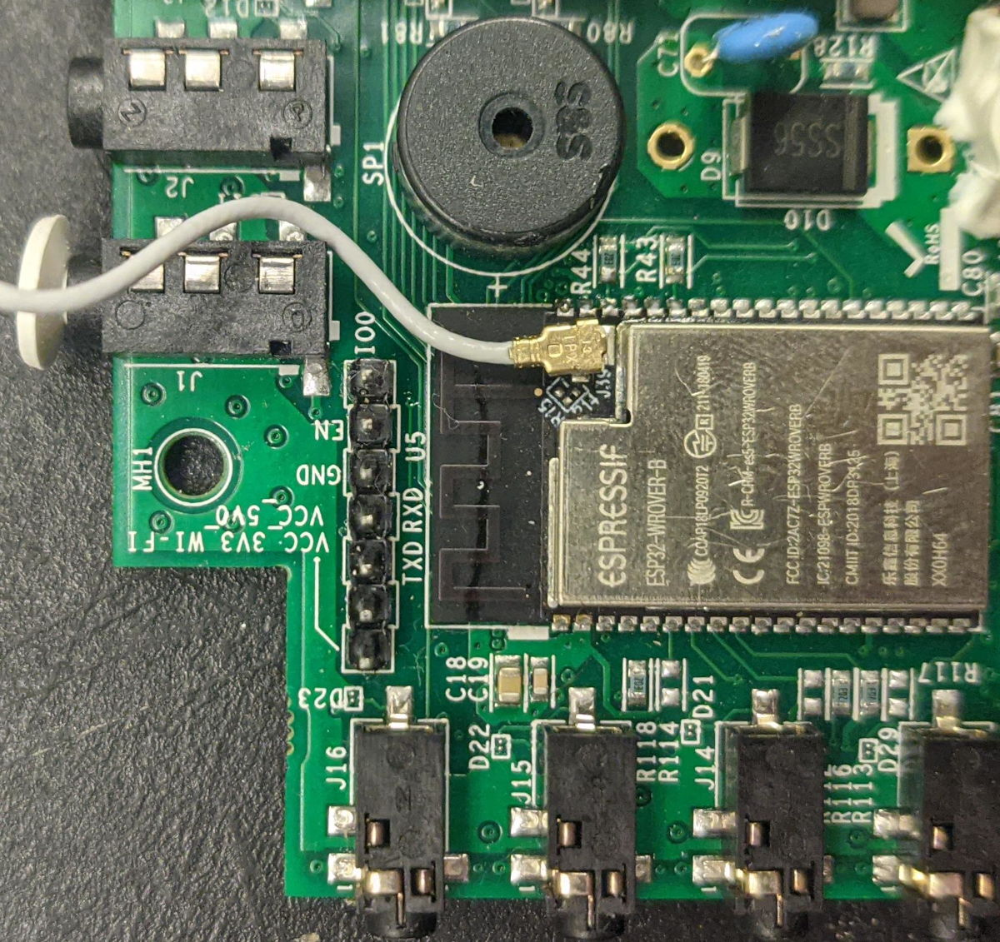
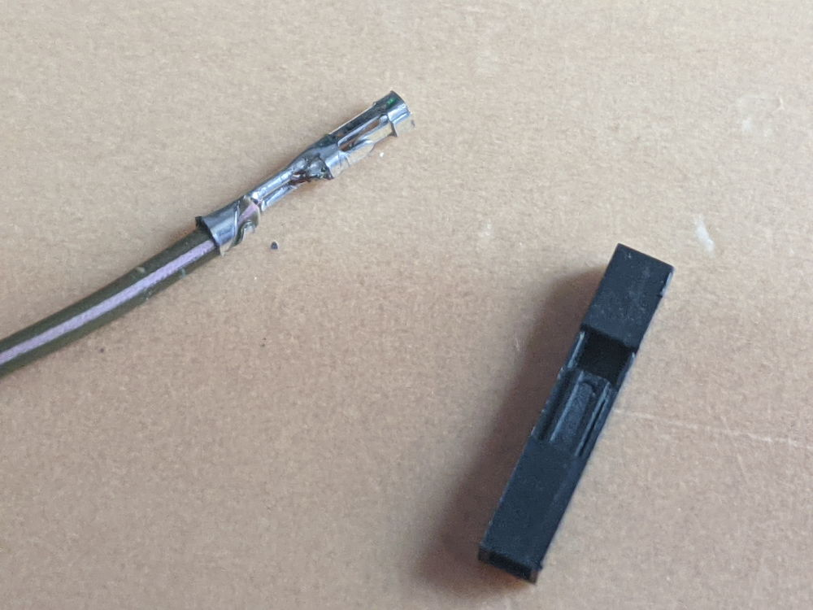
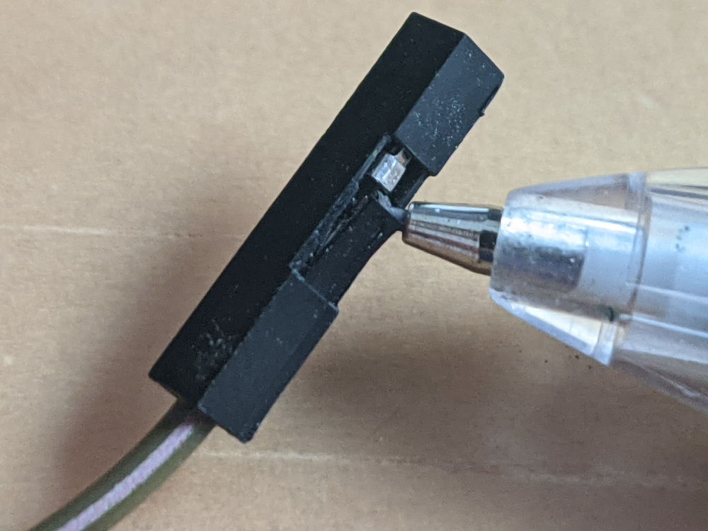

# Hardware Preparation (Vue 2)

Guide the user through the physical modification of the device and the electrical panel work.

## Panel Installation (Part 1)

### Mapping circuits
* The "Writing on tape" step.

### Identifying phases and multipliers

## Vue 2 Modification

### Opening the case

Use a small philips screwdriver to open the case. You will then need to solder a serial header onto the programming port, so that it looks like this:

## Connecting UART

Plug the USB adapter in. Connect the pins according to the following table:

| Adaptor | Vue |
|---------|-----|
| RX      | RX  |
| TX      | TX  |
| GND     | GND |

:::warning

Do not connect 5V or 3.3V at this time.

:::

### Connecting DTR/RTS

If your TTL adapter has both the DTR and RTS pins exposed, you can let it automatically reboot the board and put the chip into flash mode when necessary. Connect those now:

| Adaptor | Vue |
|---------|-----|
| DTR     | IO0 |
| RTS     | EN  |

### Using ground jumper

If your adaptor does not have a DTR and RTS pin, you can manufacture a ground jumper wire.

Pry the lever on one of the jumper cables up using a pencil or a needle or some other sharp thing. If your cables don't have a lever, cut one end of the cable & strip it using scissors or a knife.

Plug in the unmodified end of the cable into the IO0 pin of the Emporia Vue 2, and tape down (or, less ideally, hold) the other end onto the shield

## Connect power

:::warning

Do not mix up 5V and 3V, or you will destroy your board.

:::

Connect 5V on your UART adapter to the `VCC_5V0` pin on the board.

Because you have either taped down IO0 to ground or are using the DTR/RTS pins, your board is now in bootloader mode, and you can now backup software off of it and load new software on.
