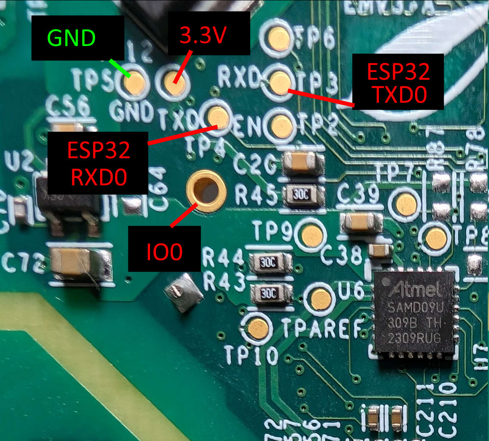

# Hardware Preparation (Vue 3)

## Opening the case

Disassembly is fairly straightforward. Remove all the screws from the bottom, and possibly loosen the SMA connector a bit.
Then you should be able to pop the two halves of the plastic case open, carefully with a pry tool or similar.

## Connecting UART

:::warning

Do not connect 5V or 3.3V at this time.

:::

Once inside, there are five test point pads involved to flash the Vue 3:

[See the original thread](https://github.com/emporia-vue-local/esphome/discussions/264) for additional tips/instructions.

Connect your USB serial's RX pin to the test point the board labels as RXD/TP3 (this is actually the ESP32's TXD0 pin)
and your serial's TX pin to the test point the board labels TXD/TP4 (this is actually the ESP32's RXD0 pin).

Connect the USB serial's GND to the board's GND/TP5. Connect the plated through-hole "ring" (labeled IO0 in the picture, no label on the board itself) to ground with a jumper wire.

## Connect power

:::warning

Do not mix up 5V and 3V, or you will destroy your board.

:::

All that's left to enter bootloader mode is to power the ESP32 via the 3.3V test point (labeled in the picture, next to GND/TP5 on the board).

Because you have either taped down IO0 to ground or are using the DTR/RTS pins, your board is now in bootloader mode, and you can now backup software off of it and load new software on.
