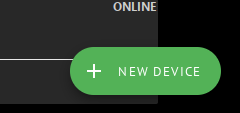
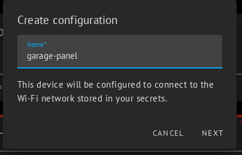
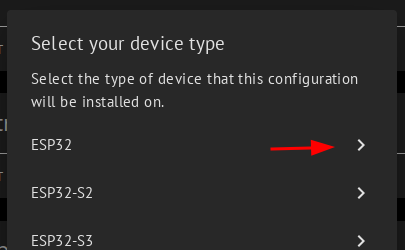
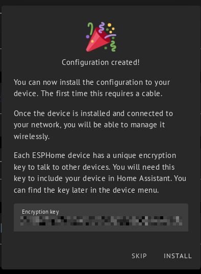
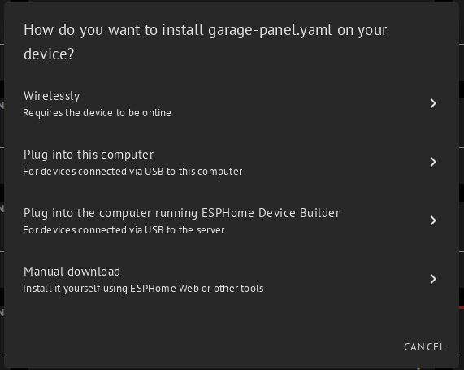

import Link from '@docusaurus/Link';

# Flashing

## Verifying the connection

Open a console window where `esptool` is available. Test it using `esptool version`.

## Preparation

Follow the instructions for your specific hardware:

  <Link
    className="pagination-nav__link"
    to="/docs/tutorial/hardware-prep-v2/">
    
Continue to

    
Hardware Prep for the Emporia Vue 2

  </Link>
  <Link
    className="pagination-nav__link"
    to="/docs/tutorial/hardware-prep-v3/">
    
Continue to

    
Hardware Prep for the Emporia Vue 3

  </Link>

## Backing up factory software

:::warning

Successful completion of this step is _critical_ in case something goes wrong later. This file is necessary to restore the device to factory function.

:::

Run the following in the console: `esptool --port /dev/ttyFIXME read-flash 0 ALL vue-orig-backup.bin`. Replace `ttyFIXME` with your serial port, and the rest of the connection details will be auto-detected.

If you're having trouble make sure that the TX/RX lines are correct, that you are grounding the GPIO0 pin before you provide DC voltage to the ESP32, and that your serial dongle can provide enough 3.3V/5V power that the ESP32 needs.

:::info

**Apple Silicon (M1, M2, etc)**

If you're using an Apple Silicon (M1, M2, etc) CPU and it stops working after a certain percentage every time, try using a different machine.

:::

## Flashing ESPHome

Use the ESPHome dashboard to perform the initial flashing, which is just a placeholder configuration. We will load the configuration for your specific setup later, over WiFi, once the system is installed in the panel.

In the ESPHome dashboard, click "New Device". 

Enter a device name for your Vue, which you will use later to identify it if you have multiple panels.

Select "ESP32" as the device type.

Click "Install"

Proceed to flash the board by clicking either "Plug into this computer" or "Plug into the computer running ESPHome Device Builder", as needed for your situation.

## Next steps

If the basic ESPHome install seems happy running from DC power, you should be ready to proceed without needing the serial wires and physical bootloader mode. You can push the real configuration later using the OTA update mechanism.

Reassemble your Vue, and follow the instructions to plug everything in & started up!
