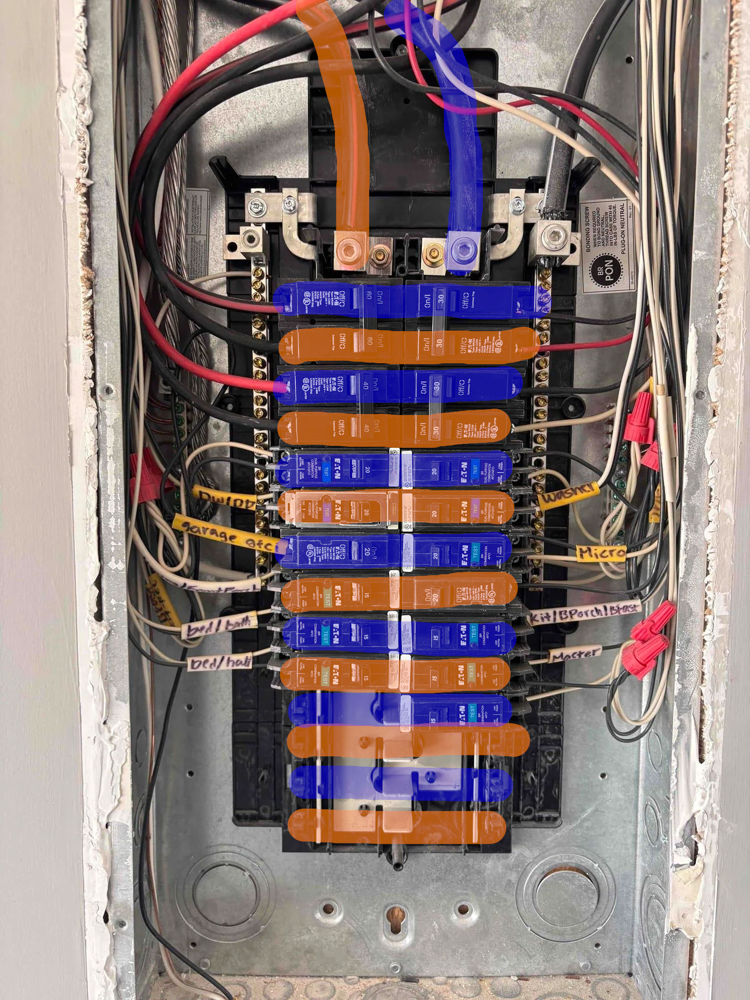

# Panel installation

:::danger

**Mains electric can kill**, especially with the limited protection in an electrical panel. This work
should only be done by a qualified person. In certain locations, **you may be required by law to hire
a licensed electrician for this work.**

:::

You'll want to install the clamps & wiring harness into your panel following the instructions [in the official Emporia installation manual](https://www.emporiaenergy.com/installation-guides).

## Data collection

:::info

You can print this page to help you collect this information.

:::

You'll want to make sure that each clamp in your panel is installed with the arrow on it pointing in the direction of the current flow. This is to make things easier for later.

For each clamp in your panel, you will want to record:

- What number/letter is the clamp connected to?
- What circuit in the panel is it connected to?
- What phase is it on?
- For multi-pole breakers, the multiplier.

<table className="data-collection-table">
  <thead>
    <tr>
      <th>Clamp</th>
      <th>Circuit</th>
      <th>Phase (A/B/C)</th>
      <th>Multiplier</th>
    </tr>
  </thead>
  <tbody>
    <tr><td>A</td><td></td><td></td><td></td></tr>
    <tr><td>B</td><td></td><td></td><td></td></tr>
    <tr><td>C</td><td></td><td></td><td></td></tr>
    <tr><td>1</td><td></td><td></td><td></td></tr>
    <tr><td>2</td><td></td><td></td><td></td></tr>
    <tr><td>3</td><td></td><td></td><td></td></tr>
    <tr><td>4</td><td></td><td></td><td></td></tr>
    <tr><td>5</td><td></td><td></td><td></td></tr>
    <tr><td>6</td><td></td><td></td><td></td></tr>
    <tr><td>7</td><td></td><td></td><td></td></tr>
    <tr><td>8</td><td></td><td></td><td></td></tr>
    <tr><td>9</td><td></td><td></td><td></td></tr>
    <tr><td>10</td><td></td><td></td><td></td></tr>
    <tr><td>11</td><td></td><td></td><td></td></tr>
    <tr><td>12</td><td></td><td></td><td></td></tr>
    <tr><td>13</td><td></td><td></td><td></td></tr>
    <tr><td>14</td><td></td><td></td><td></td></tr>
    <tr><td>15</td><td></td><td></td><td></td></tr>
    <tr><td>16</td><td></td><td></td><td></td></tr>
  </tbody>
</table>

For each wire in the wiring harness, you'll want to note:

- Which color cable matches which mains clamp?

<table className="data-collection-table">
  <thead>
    <tr>
      <th>Color</th>
      <th>Phase (A/B/C)</th>
    </tr>
  </thead>
  <tbody>
    <tr><td>Black</td><td></td></tr>
    <tr><td>Red</td><td></td></tr>
    <tr><td>Blue</td><td></td></tr>
  </tbody>
</table>

## Panel phases (USA)

If you haven't seen a panel before, the concept of phases may be confusing. Here's what your typical American electrical panel looks like with the cover off:

Note how here are two thick wires coming in, one on the left, and another on the right. What's not 
so obvious without the highlighting is that each row in the panel only corresponds to one of these
wires. You can see that each circuit breaker plugs into a rib on the "bus bar", and how multi-pole
(double wide) breakers plug into two different ribs.

Each panel is different, so you can't just assume that your panel will follow the same layout.
There should be a diagram or schematic either on a sticker in the panel cover or in the manual.
